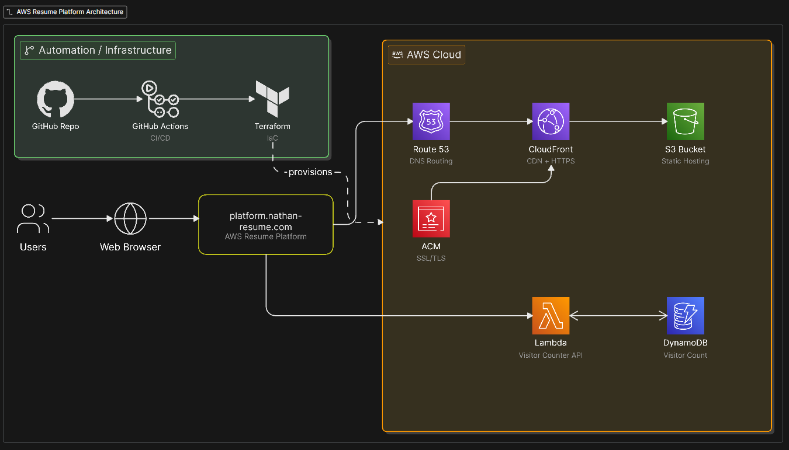

# AWS Resume Platform
🔗 **Live Resume Website:** [nathan-ambroise.cloud](https://platform.nathan-resume.com)  

## Overview
This project is a cloud-hosted resume platform built on AWS using Terraform, serverless services, and CI/CD automation.

## Architecture
- S3 for static website hosting
- CloudFront for CDN delivery
- Route 53 for DNS
- ACM for HTTPS certificate
- Lambda for backend visitor counter logic
- DynamoDB for storing visitor count data
- GitHub Actions for CI/CD
- Terraform for infrastructure as code

## What I Built
I designed an AWS Resume Platform focused on automation, scalability, and production-style deployment.
Lambda, DynamoDB, and IAM permissions were provisioned with Terraform.
S3, CloudFront, Route 53, and ACM were configured manually through the AWS Console.

## Skills Demonstrated
- AWS cloud architecture
- Serverless application design
- Infrastructure as Code with Terraform
- CI/CD with GitHub Actions
- DNS and HTTPS configuration
- DynamoDB + Lambda backend integration
- Frontend deployment to S3/CloudFront

## Architecture Diagram

## Technical Documentation
See the full step-by-step build guide here: [STEP-BY-STEP.md](docs/STEP-BY-STEP.md)

